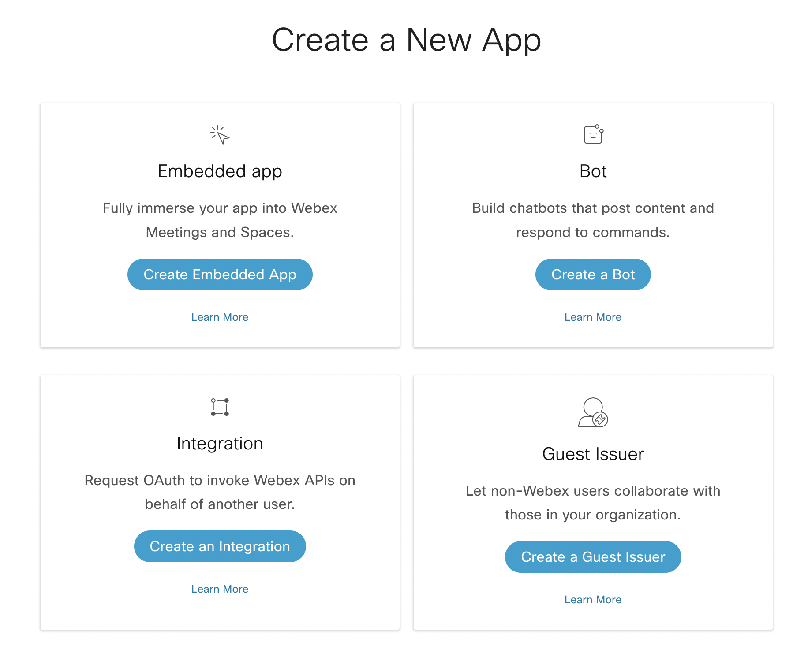
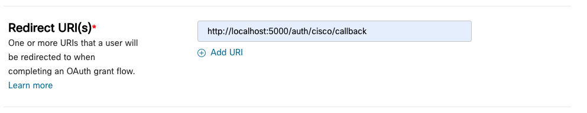
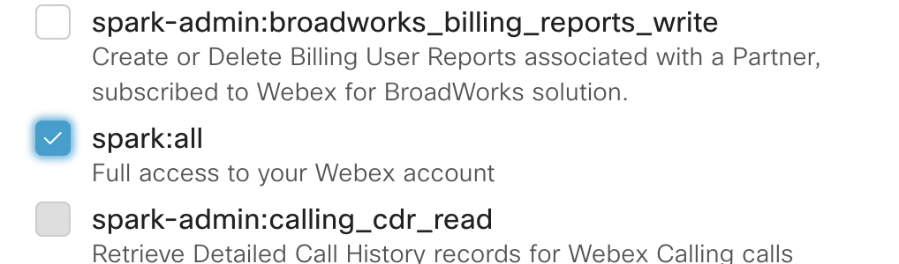
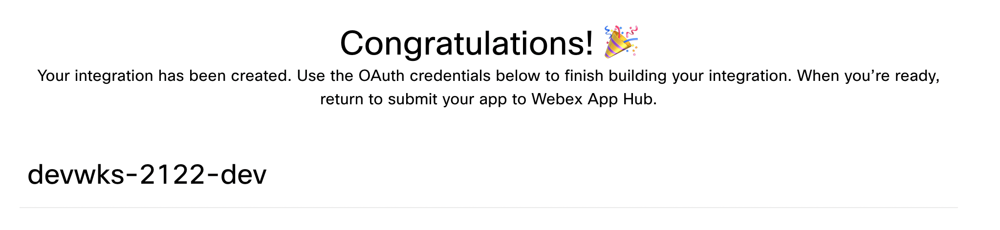

# Webex Integration

To be able to make an authentication request to the Webex service, we first need to create a Webex Integration. An integration allows us to authenticate a user and ask for certain permissions from the user. We may then make API requests on their behalf. After they have provided this initial access, we can then use it to authenticate the user as well.

## Create the Webex Integration

We need to go to the Webex Developer site to sign in and then create our integration.
Follow this [link](https://developer.webex.com/) to go the developer site. After this site loads, click on **Log in** on the top right and sign in with your Cisco login.

After getting logged in, click on the **Start Building Apps** button in the middle left side of the page.

It will bring you to the **Create a New App** screen.  


Click on the **Create an Integration** in the bottom left box to make our integration.

It will look the below image minus the filled in the fields:


The first radio button to `no` because we will not be using this in a mobile SDK.

Select and Icon that you prefer.

Please give the Integration a name that ends with `dev` so that it can easily be discerned it is for development purposes.

You may enter any description for this integration that you would like, but this example says it’s for an example application.

The **Redirect URI(s)** section is very important to this workshop. The redirect URI will be used by the Integration to send the finished authentication request to. We will be using `localhost:5000/auth/cisco/callback` as the value in this field.

It should look like the below image:


The next field are the **Scopes** these are the permissions the application will have after the user authenticates. For our application, we will be using `spark:all`. Please select this scope and then we can create the integration.



Click on **Add Integration** at the very bottom of the page. Your integration should be created, and a congratulations screen will come up.



We need to store the WebEx integration ID and Secret in a file called `keys.js`. This file is does not exist yet, but there is an example file called `exKey.js` located in the `config` directory.
Copy the `Client ID` from the Webex Integration and paste it between the two single quotes next to `ciscoClientID`. Do the same with the `Client Secret`, pasting it on the line with `ciscoClientSecret`. We need to add some random text to the `cookieKey` field as well. This can be anything you want to type in. The `cookieKey` will be used to encrypt our session cookie later on in this workshop.

Now we need to rename the file to `keys.js`.

```javascript title='/config/keys.js' showLineNumbers
module.exports = {
  ciscoClientID: '',
  ciscoClientSecret: '',
  cookieKey: 'randomSecretKey',
};
```

:::note
It is possible to regenerate the client secret from the Integration page.
:::

We have stored the integration data and can now explain how the OAuth flow will work.
