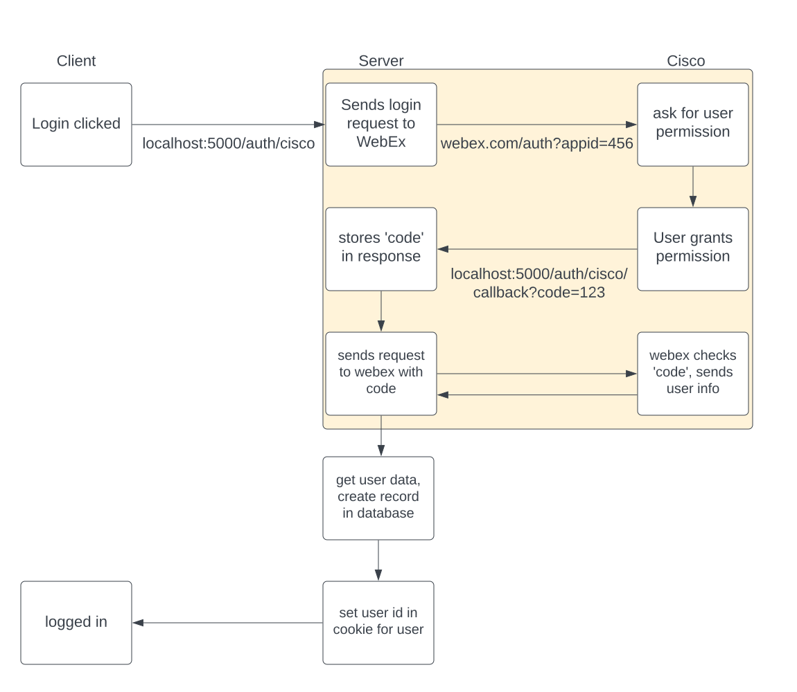

# OAuth flow

To be able to better understand what will be happening later on in this workshop, it will be best to go over the OAuth flow and then what PassportJs will take care of.

In the diagram above, we see there are three pieces to the OAuth flow. The `client`, `server`, and `Cisco`.

Each of them handle a different portion of the flow. The client first sends a request to the backend server at the authentication route for Cisco. Then the server sends a request to WebEx with the ID of our integration.

WebEx will then ask the user to authenticate and grant permissions. The user then grants permission and the WebEx Integration respondes with a `code` to the server using the `Redirect URI` we setup previously.  
:::note
The permissions request will only happen the first time they login to this application.
:::

The server stores this code and sends a new request to WebEx with the code. WebEx will check this code and if it is valid, return the User data.

The server will then parse the user data and create a new user in the database if they did not previously exist. Then it will set a cookie and pass it back to the client, where the client will not be logged in.

We will be using Passport to take care of most of this process. The below diagram has a highlighted box around the pieces PassportJs will take care of:

Now we can go ahead and start installing the Passport library and its strategies.
